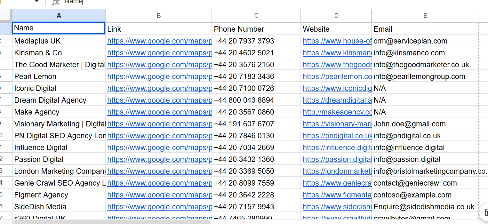
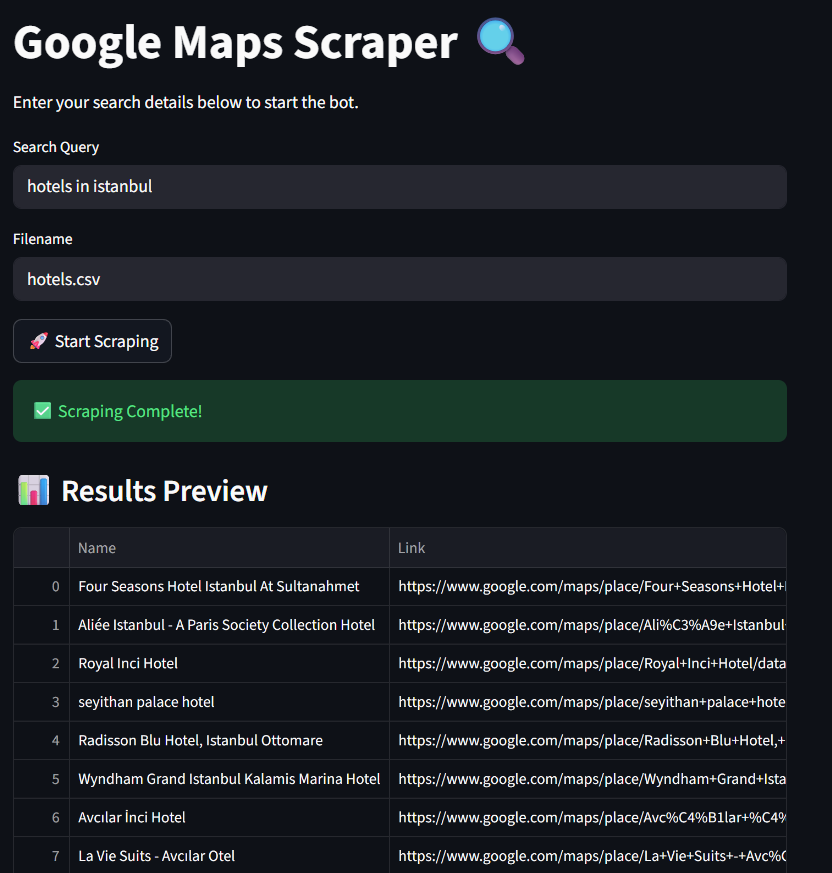

# 🗺️ GMaps Lead Scraper (with Email Hunter)

A powerful Python automation tool that scrapes business leads from Google Maps. Unlike basic scrapers, this bot performs **Deep Enrichment**: it extracts the phone number from Google Maps, visits the business's external website, and scans for email addresses automatically.


*Above: Actual output showing extracted names, phones, websites, and emails.*


*Above: The Streamlit Web Interface for easy searching.*

##  Features

* **Automated Search:** Types queries and scrolls through Google Maps results.
* **Data Extraction:** Grabs Name, Google Maps Link, Phone Number, and Website URL.
* **Email Hunter:** Automatically visits the business's external website to find contact emails (e.g., `info@agency.com`) using Regex.
* **CSV Export:** Saves data in real-time to avoid data loss during crashes.
* **Modular Architecture:** Clean separation of concerns (`src/operation`, `src/common`).

## Project Structure

```text
GMaps-Lead-Scraper/
├── src/
│   ├── main.py                # Entry point (Streamlit App)
│   ├── common/
│   │   └── logger.py          # Custom logging setup
│   └── operation/
│       ├── scraper.py         # Search & Scroll logic
│       └── extract.py         # Data extraction & Email hunting logic
├── leads.csv                  # Output file
├── requirements.txt           # Python dependencies
└── README.md
```

## Installation
```bash
git clone [https://github.com/itsbedri/GMaps-Lead-Scraper.git](https://github.com/itsbedri/GMaps-Lead-Scraper.git)
cd GMaps-Lead-Scraper
```

```bash
python -m venv .venv
```

* to activate
```bash
# Windows:
.venv\Scripts\activate
# Mac/Linux:
source .venv/bin/activate
```

* install the requirments
```bash
pip install -r requirments.txt
```

## Usage

``` bash
streamlit run .\src\main.py
```

1. Enter your search query (e.g., "Digital Marketing Agencies in London").
2. Enter the output filename (e.g., leads.csv).

The bot will open a browser, start collecting data, and save it to your CSV file.


⚠️ Disclaimer
This tool is for educational purposes only. Please respect Google's Terms of Service and robots.txt policies. Do not use this for spamming or large-scale unauthorized data collection.
